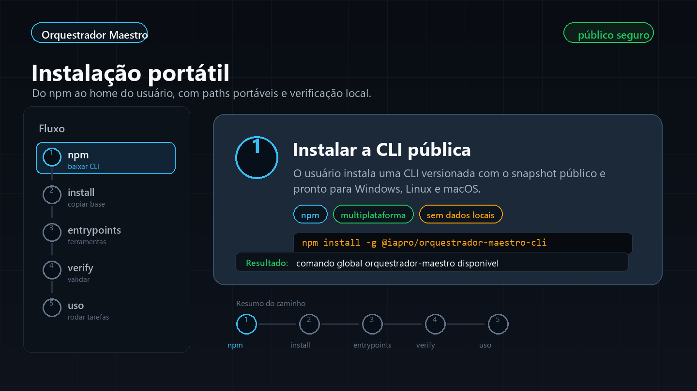
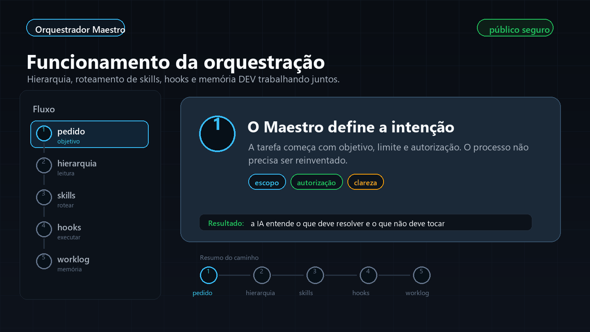
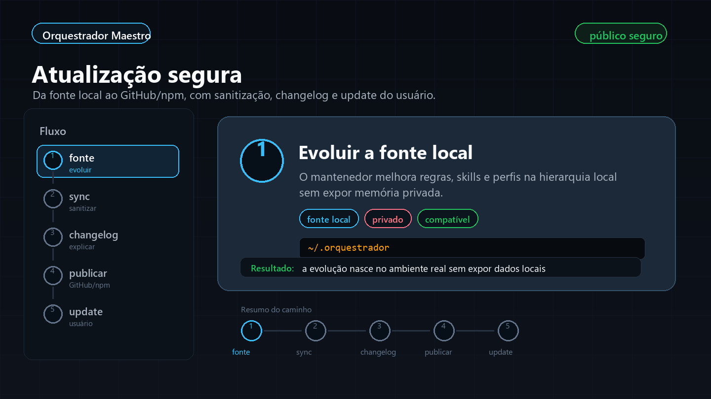

# Orquestrador Maestro

Kit público e sanitizado para instalar uma hierarquia de orquestração de IAs no Windows, Linux e macOS, com regras globais, Codex skills, hooks, roteamento de skills, perfis de ferramentas e memória operacional de projetos em `DEV/`.

Repositório: [github.com/FernandoBolzan/Orquestrador-Maestro](https://github.com/FernandoBolzan/Orquestrador-Maestro)

## Funcionamento Em 60 Segundos

O ponto central do Orquestrador Maestro é simples: ele não cria uma IA nova. Ele instala uma camada portátil de regras, skills, hooks, perfis e entrypoints para que as ferramentas de IA do usuário leiam o mesmo contrato operacional antes de agir.

Na prática, o usuário instala uma vez, e Codex, Claude Code, OpenCode, Cursor, Gemini CLI, Windsurf e Antigravity passam a encontrar o Orquestrador por padrão nas pastas corretas do próprio usuário.

### 1. Instalação Portátil



Este fluxo mostra o caminho de instalação recomendado: baixar a CLI via npm, aplicar o snapshot sanitizado no home do usuário, criar os entrypoints das ferramentas de IA, verificar a instalação e começar a usar em projetos reais.

### 2. Funcionamento Da Orquestração



Durante o uso, a IA deve ler primeiro os contratos compactos, respeitar a hierarquia, escolher a menor skill útil, executar com hooks e registrar o que importa em `DEV/WORKLOG.md` quando houver trabalho substancial.

### 3. Atualização Segura



O projeto público funciona como snapshot sanitizado. O mantenedor evolui a fonte local, exporta, valida, documenta no changelog, publica no GitHub/npm e o usuário atualiza com os comandos da CLI.

## Instalação Recomendada

Para instalar direto pelo npm:

```bash
npm install -g @iapro/orquestrador-maestro-cli
orquestrador-maestro install
orquestrador-maestro verify
```

Para atualizar depois:

```bash
npm update -g @iapro/orquestrador-maestro-cli
orquestrador-maestro update
orquestrador-maestro verify
```

Se preferir Git/ZIP, use as seções de instalação completa abaixo. O npm é o caminho mais simples para quem só quer instalar e manter atualizado.

## Modelo Mental

- **Maestro**: o usuário define objetivo, limite, prioridade e autorizações.
- **Orquestrador**: a IA executa seguindo regras, hierarquia, roteamento de skills, hooks e verificação.
- **Skills**: playbooks especializados que entram só quando ajudam a tarefa.
- **Hooks**: lembretes operacionais para segurança, documentação, economia de contexto e validação.
- **DEV/**: memória operacional local do projeto, usada para reduzir repetição e economizar tokens.
- **Snapshot público**: este repositório publica apenas a parte instalável e sanitizada, sem dados privados.

## Sumário

- [Iniciativa Grupo IAPro](#iniciativa-grupo-iapro)
- [Requisitos e Compatibilidade](#requisitos-e-compatibilidade)
- [Contribuição Da Comunidade](#contribuição-da-comunidade)
- [Melhorias Recentes](#melhorias-recentes)
- [Radar De Maio 2026](#radar-de-maio-2026)
- [Visão Geral](#visão-geral)
- [Instalação Via npm](#instalação-via-npm)
- [Como Funciona](#como-funciona)
- [Hierarquia DEV Nos Projetos](#hierarquia-dev-nos-projetos)
- [Atualizar Uma Instalação](#atualizar-uma-instalação)
- [Segurança E Privacidade](#segurança-e-privacidade)
- [Changelog](#changelog)

## Iniciativa Grupo IAPro

O Orquestrador Maestro é uma iniciativa do Grupo IAPro, uma comunidade de WhatsApp e Discord para quem está construindo, estudando e aplicando IA no trabalho real: automações, agentes, desenvolvimento, produto, operações e novos fluxos com ferramentas de IA.

Participe da comunidade pelo link:

[fernandobolzan.com/bio](https://www.fernandobolzan.com/bio)

A proposta do projeto é compartilhar uma base prática e instalável para que mais pessoas consigam configurar suas IAs com hierarquia, skills, hooks, documentação local e boas práticas de segurança, sem depender de uma configuração privada de uma máquina específica.

## Requisitos e Compatibilidade

Para garantir que o Orquestrador Maestro funcione corretamente em seu ambiente, verifique os requisitos mínimos:

- **Windows**: PowerShell 4.0 ou superior (padrão no Windows 10/11; no Windows 7 SP1, requer a instalação do Windows Management Framework 4.0).
- **Linux/macOS**: Bash 3.2 ou superior (padrão no macOS e na maioria das distribuições Linux).
- **Sistemas Operacionais**: Windows 10/11, Linux (Ubuntu, Debian, CentOS, etc.) e macOS 10.15+.
- **Node.js** (Opcional): Recomendado (versão 10.12.0 ou superior) para funções de gerenciamento, como criação de novas skills, validação do catálogo e sincronização dinâmica no Linux/macOS. O funcionamento básico das regras e skills já instaladas não depende do Node.js.

Caso você esteja utilizando uma versão muito antiga de algum SO que não suporte esses requisitos, os scripts de instalação podem apresentar erros de sintaxe ou comandos não encontrados.

## Contribuição Da Comunidade

O suporte Linux/macOS foi integrado a partir do fork [`kivervinicius/Orquestrador-Maestro`](https://github.com/kivervinicius/Orquestrador-Maestro), aberto na PR [#1 - feat: suporte multiplataforma (Linux/macOS)](https://github.com/FernandoBolzan/Orquestrador-Maestro/pull/1).

O que foi aproveitado e melhorado:

- instalador Bash para Linux/macOS em `install.sh` e `scripts/install.sh`;
- verificador Bash em `scripts/verify-install.sh`;
- inicializador `DEV/` para Unix em `scripts/init-project-dev.sh` e `.orquestrador/bin/init-project-dev.sh`;
- sincronizador Unix de skills em `.orquestrador/sync-skills.sh`;
- README com comandos separados para Windows, Linux e macOS.

Antes da integração, os scripts foram ajustados para evitar dependência de `readlink -f`, funcionar no Bash antigo do macOS, copiar community skills e Codex skills para o mesmo destino sem perder fontes, manter proteção antes de remoções recursivas e aceitar `--home-path` para testes isolados.

Também foi integrada a PR [#2 - feat: add canonical skill management and validation scripts](https://github.com/FernandoBolzan/Orquestrador-Maestro/pull/2), criada por [`kivervinicius`](https://github.com/kivervinicius) e mergeada em 2026-05-23. Essa contribuição consolidou o fluxo canônico de skills:

- scripts `scripts/new-canonical-skill.ps1` e `scripts/new-canonical-skill.sh` para criar novas skills canônicas;
- `scripts/skill-catalog.js` para apoiar catálogo, criação e validação de skills;
- `orquestrador/SKILLS_MANIFEST.json` como registro canônico de skills e comportamento de espelhamento;
- `orquestrador/sync-skills.ps1` e `orquestrador/sync-skills.sh` lendo o manifesto em vez de listas rígidas;
- validação em `scripts/validate-skills.ps1` e `scripts/validate-skills.sh`;
- documentação atualizada em `docs/skill-catalog.md`, `docs/update-flow.md` e `orquestrador/SKILLS_ORGANIZATION.md`.

Na prática, a PR #2 deixou o projeto mais fácil de manter: novas skills passam por um caminho repetível de criação, manifesto, sincronização, validação e documentação.

Crédito também ao Bruno, integrante da comunidade Grupo IAPro, pela curadoria e pelo papo que trouxe as referências de RTK e Caveman para a discussão. Essa contribuição ajudou a priorizar melhorias de economia de contexto, redução de leitura desnecessária, uso mais consciente da pasta `DEV/` e organização do Orquestrador para evitar gasto excessivo de tokens.

## Melhorias Recentes

A versão atual também incorporou aprendizados de projetos como [`rtk-ai/rtk`](https://github.com/rtk-ai/rtk) e [`juliusbrussee/caveman`](https://github.com/juliusbrussee/caveman), adaptados ao objetivo do Orquestrador Maestro: instalar uma configuração pública, auditável e reutilizável para vários agentes de IA.

Principais melhorias:

- instalador previsível com `DryRun`, `ListTargets`, `Only`, `Uninstall`, `NonInteractive` e `VerbosePaths` no PowerShell e no Bash;
- saída segura por padrão, com caminhos locais redigidos nos relatórios de instalação e remoção;
- validação pública reforçada contra arquivos locais, temporários, caches, memórias privadas e raízes como `.omx/`, `.local/` e `DEV/`;
- smoke tests em home temporário para validar instalação, verificação, listagem e desinstalação sem tocar no usuário real;
- matriz de entrypoints em `orquestrador/PROGRAM_ENTRYPOINTS.json` para Codex, Claude Code, OpenCode, Cursor, Gemini CLI, Windsurf e Antigravity;
- documentação de economia de contexto para orientar IAs a lerem primeiro regras, índices, roteadores e `DEV/` antes de carregar arquivos longos.

Para entender os detalhes, veja [docs/installer-options.md](docs/installer-options.md), [docs/context-economy.md](docs/context-economy.md), [docs/privacy-model.md](docs/privacy-model.md) e [docs/orquestrador-reference.md](docs/orquestrador-reference.md).

## Radar De Maio 2026

A atualização mais recente revisou projetos públicos de agentes, harness engineering, MCP, skills e memória com atividade verificada no GitHub entre abril e maio de 2026. O objetivo não é copiar código, e sim transformar bons padrões em documentação, validação e próximos passos próprios do Orquestrador.

O que ficou como direção técnica:

- **canais e atualização**: projetos como [`openai/codex`](https://github.com/openai/codex) e [`google-gemini/gemini-cli`](https://github.com/google-gemini/gemini-cli) reforçam que CLI pública precisa ter instalação simples, update previsível, changelog claro e canais de release bem explicados antes de criar variantes como `latest`, `preview` ou `nightly`;
- **telemetria explícita**: [`google-gemini/gemini-cli`](https://github.com/google-gemini/gemini-cli), [`ChromeDevTools/chrome-devtools-mcp`](https://github.com/ChromeDevTools/chrome-devtools-mcp) e [`entireio/cli`](https://github.com/entireio/cli) reforçam que telemetria e coleta de sessão devem ter documentação objetiva, botão de desligar, payload permitido e proibição clara de dados privados;
- **harness determinístico**: [`coleam00/archon`](https://github.com/coleam00/archon), [`ai-boost/awesome-harness-engineering`](https://github.com/ai-boost/awesome-harness-engineering) e [`aiming-lab/AutoHarness`](https://github.com/aiming-lab/AutoHarness) apontam para fases, gates, artefatos, validação e planos/checkpoints como parte do produto, não como detalhe interno;
- **subagentes portáveis**: [`shinpr/sub-agents-mcp`](https://github.com/shinpr/sub-agents-mcp) mostra um caminho para definir agentes em Markdown e expor execução por MCP, mantendo o padrão do Orquestrador de criar perfis reutilizáveis sem prender tudo a uma única ferramenta;
- **engenharia de contexto**: [`bonigarcia/context-engineering`](https://github.com/bonigarcia/context-engineering), [`deepset-ai/haystack`](https://github.com/deepset-ai/haystack), [`sbhooley/ainativelang`](https://github.com/sbhooley/ainativelang) e [`MemTensor/MemOS`](https://github.com/MemTensor/MemOS) reforçam o modelo de contexto em camadas: instruções, memória, ferramentas, estado, roteamento, custo, auditoria e governança;
- **SkillOps**: [`gotalab/skillport`](https://github.com/gotalab/skillport) entra como referência estável para a ideia de gerenciar skills uma vez e servir em múltiplas ferramentas via CLI ou MCP.

O radar completo, com data de atividade, licença e decisão de aproveitamento, está em [docs/research/repo-radar-2026-05.md](docs/research/repo-radar-2026-05.md).

Na prática, isso deixa o roadmap público mais claro:

1. manter `npm install -g` e `orquestrador-maestro update` como caminho simples;
2. só adicionar canais `preview` ou `nightly` quando houver cadência real de release;
3. manter telemetria anônima, documentada, desativável e sem caminhos locais;
4. evoluir `DEV/` com templates de plano, implementação, verificação e handoff;
5. estudar MCP/subagentes como camada opcional, sem quebrar a instalação atual;
6. documentar cada referência externa antes de transformar qualquer padrão em código.

## Visão Geral

O Orquestrador Maestro é uma camada portátil de instruções para fazer várias IAs trabalharem com o mesmo contrato operacional no computador do usuário. Ele não é uma IA nova, nem substitui Codex, Claude Code, OpenCode, Cursor, Gemini CLI ou Windsurf. Ele instala arquivos que essas ferramentas conseguem ler para padronizar:

- onde a IA busca regras;
- como ela identifica o papel do usuário como Maestro;
- como escolhe skills sem carregar contexto demais;
- quando deve usar hooks, verificação, docs locais e agentes auxiliares;
- onde registra memória curta do projeto para economizar tokens;
- quais arquivos nunca devem ser publicados.

A ideia prática é simples: a pessoa baixa este repositório, executa o instalador e recebe a mesma estrutura base no próprio home: `%USERPROFILE%` no Windows ou `$HOME` no Linux/macOS. Os placeholders são trocados para o usuário que está instalando. O pacote foi preparado para publicação, então não deve conter tokens, logs, caches, memórias locais, backups ou caminhos reais da máquina fonte.

## Para Quem Serve

Este repositório é útil para quem quer:

- configurar um ambiente de IA local com regras consistentes;
- compartilhar uma base de skills e hooks sem expor dados pessoais;
- usar Codex, Claude Code, OpenCode, Cursor, Gemini CLI e Windsurf com a mesma hierarquia;
- fazer agentes lerem a pasta `DEV/` dos projetos antes de gastar tokens em exploração longa;
- manter um padrão repetível de instalação em qualquer usuário Windows, Linux ou macOS;
- evoluir skills localmente e depois publicar um snapshot sanitizado.

## Download

Clone com Git:

```bash
git clone https://github.com/FernandoBolzan/Orquestrador-Maestro.git
cd Orquestrador-Maestro
```

Download em ZIP:

[Baixar ZIP da branch main](https://github.com/FernandoBolzan/Orquestrador-Maestro/archive/refs/heads/main.zip)

Se baixar como ZIP, extraia a pasta antes de executar os comandos abaixo.

## Instalação Via npm

Também é possível distribuir o Orquestrador Maestro como pacote npm:

```bash
npm install -g @iapro/orquestrador-maestro-cli
```

Depois instale no home do usuário:

```bash
orquestrador-maestro install
orquestrador-maestro verify
```

Para atualizar:

```bash
npm update -g @iapro/orquestrador-maestro-cli
orquestrador-maestro update
orquestrador-maestro verify
```

O pacote instala o comando `orquestrador-maestro`, mas não altera o home automaticamente durante o `npm install`. A alteração acontece quando o usuário roda `orquestrador-maestro install` ou `orquestrador-maestro update`, o que deixa o fluxo mais auditável e seguro.

O CLI tem suporte a telemetria anônima para medir comandos como `install`, `update`, `verify`, `dry-run` e `uninstall`. Ela fica desabilitada por padrão e só envia eventos depois de o usuário configurar um endpoint e habilitar explicitamente. Configurações antigas sem consentimento versionado são tratadas como desabilitadas até o usuário rodar `orquestrador-maestro telemetry enable` novamente. Ela não envia telefone, nome de usuário, caminho local, prompts, logs, tokens ou conteúdo de projeto.

Para habilitar:

```bash
orquestrador-maestro telemetry endpoint https://seu-dominio.example/api/orquestrador-telemetry
orquestrador-maestro telemetry enable
orquestrador-maestro telemetry test
```

Para desabilitar:

```bash
orquestrador-maestro telemetry disable
```

Guia completo: [docs/npm-package.md](docs/npm-package.md).

## Instalação Rápida

Prévia sem alterar arquivos:

```powershell
powershell -NoProfile -ExecutionPolicy Bypass -File .\install.ps1 -DryRun
```

Linux/macOS:

```bash
bash install.sh --dry-run
```

### Windows

Abra o PowerShell dentro da pasta do repositório e rode:

```powershell
powershell -NoProfile -ExecutionPolicy Bypass -File .\install.ps1
```

Depois verifique:

```powershell
powershell -NoProfile -ExecutionPolicy Bypass -File .\scripts\verify-install.ps1
```

### Linux/macOS

Abra o terminal dentro da pasta do repositório e rode:

```bash
bash install.sh
```

Depois verifique:

```bash
bash scripts/verify-install.sh
```

Se a verificação passar, as ferramentas instaladas já passam a ter pontos de entrada globais apontando para o Orquestrador Maestro.

## Instalação Guiada Por IA

Você também pode pedir para uma IA instalar o pacote. Use um pedido assim:

Windows:

```text
Baixe ou clone https://github.com/FernandoBolzan/Orquestrador-Maestro,
execute install.ps1 no PowerShell, rode scripts/verify-install.ps1
e confirme que o Orquestrador Maestro foi instalado no meu %USERPROFILE%.
Não exponha tokens, logs, caches, arquivos privados ou caminhos de outra máquina.
```

Linux/macOS:

```text
Baixe ou clone https://github.com/FernandoBolzan/Orquestrador-Maestro,
execute install.sh com Bash, rode scripts/verify-install.sh
e confirme que o Orquestrador Maestro foi instalado no meu $HOME.
Não exponha tokens, logs, caches, arquivos privados ou caminhos de outra máquina.
```

A IA deve usar o usuário atual da máquina dela. Ela não deve copiar caminhos absolutos de outra pessoa.

## O Que A Instalação Cria

Por padrão, o instalador copia o núcleo, skills, agentes, prompts e perfis de ferramentas para o home do usuário atual.

| Destino Windows | Destino Linux/macOS | Função |
|---|---|---|
| `%USERPROFILE%\.orquestrador` | `$HOME/.orquestrador` | Núcleo canônico com regras, Maestro, hooks, roteadores, índices, scripts e skills principais. |
| `%USERPROFILE%\AGENTS.md` | `$HOME/AGENTS.md` | Contrato global que Codex e outros agentes devem ler como regra de usuário. |
| `%USERPROFILE%\.codex\skills` | `$HOME/.codex/skills` | Skills do Codex/OMX e skills canônicas espelhadas. |
| `%USERPROFILE%\.codex\agents` | `$HOME/.codex/agents` | Perfis de subagentes Codex. |
| `%USERPROFILE%\.codex\prompts` | `$HOME/.codex/prompts` | Prompts de papéis usados por agentes. |
| `%USERPROFILE%\.agents\skills` | `$HOME/.agents/skills` | Raiz legada de skills para compatibilidade com outras ferramentas. |
| `%USERPROFILE%\.claude\skills` | `$HOME/.claude/skills` | Espelho de skills para Claude Code. |
| `%USERPROFILE%\.opencode\skills` | `$HOME/.opencode/skills` | Espelho de skills para OpenCode. |
| `%USERPROFILE%\.cursor\skills` | `$HOME/.cursor/skills` | Espelho de skills para Cursor. |
| `%USERPROFILE%\.gemini\skills` | `$HOME/.gemini/skills` | Espelho de skills para Gemini CLI. |
| `%USERPROFILE%\.windsurf\skills` | `$HOME/.windsurf/skills` | Espelho de skills para Windsurf. |
| `%USERPROFILE%\.antigravity-skills\skills` | `$HOME/.antigravity-skills/skills` | Espelho de skills para ambientes compatíveis. |
| `%USERPROFILE%\.ai-standards` | `$HOME/.ai-standards` | Standards portáteis usados pelo Antigravity. |
| `%USERPROFILE%\.orquestrador-public-backups` | `$HOME/.orquestrador-public-backups` | Backups criados quando o instalador substitui arquivos existentes. |

O instalador também cria perfis textuais e entrypoints para ferramentas. Eles são os arquivos que fazem o Orquestrador ser chamado por padrão.

| Ferramenta | Entry points instalados |
|---|---|
| Codex | `.codex\AGENTS.md`, `.codex\skills`, `.codex\agents`, `.codex\prompts`, e o `AGENTS.md` global do usuário. |
| OpenCode | `.config\opencode\AGENTS.md`, `.config\opencode\opencode.json`, `.opencode\SYSTEM.md`, `.opencode\rules.md`, `.opencode\maestro.md`, `.opencode\hooks.md`, `.opencode\SKILLS_INDEX.md`, `.opencode\default-skill.json`. |
| Claude Code | `.claude\CLAUDE.md`, `.claude\SYSTEM_PROMPT.md`, `.claude\hooks.md`, `.claude\skills`. |
| Cursor | `.cursor\AGENTS.md`, `.cursor\rules\orquestrador-maestro.mdc`, `.cursor\hooks.md`, `.cursor\skills`. |
| Gemini CLI | `.gemini\GEMINI.md`, `.gemini\hooks.md`, `.gemini\skills`. |
| Windsurf | `.codeium\windsurf\memories\global_rules.md`, `.windsurf\hooks.md`, `.windsurf\skills`. |
| Antigravity | `antigravity-rules.json`, `.antigravity\antigravity.json`, `.antigravity\settings.json`, `.ai-standards`, `.antigravity-skills\skills`. |

No Linux/macOS, os mesmos entrypoints são instalados com `/` sob `$HOME`, por exemplo `$HOME/.codex/AGENTS.md`, `$HOME/.config/opencode/opencode.json` e `$HOME/.ai-standards`.

Quando algum arquivo de destino já existe, o instalador faz backup antes de substituir, exceto se você usar flags que mudam esse comportamento.

## Como Funciona

O Orquestrador Maestro trabalha por hierarquia. A IA não deve sair abrindo tudo. Ela deve ler primeiro os contratos compactos, escolher o menor conjunto de contexto necessário e só então executar.

### Hierarquia De Leitura

A ordem esperada é:

1. `%USERPROFILE%\.orquestrador\rules.md` ou `$HOME/.orquestrador/rules.md`
2. `%USERPROFILE%\.orquestrador\maestro.md` ou `$HOME/.orquestrador/maestro.md`
3. `%USERPROFILE%\AGENTS.md` ou `$HOME/AGENTS.md`
4. `AGENTS.md` mais próximo do projeto atual
5. documentação `DEV/` do projeto, quando existir
6. skill ou prompt específico da tarefa

Essa ordem separa três tipos de regra:

- regras globais do usuário;
- regras locais do projeto;
- instruções técnicas da skill escolhida.

Se houver conflito entre documentos, a regra mais específica e mais próxima da tarefa deve orientar a execução, sem ignorar restrições de segurança e privacidade.

### Papel Orquestrador/Maestro

O modelo de trabalho é:

- a IA atua como Orquestrador;
- o usuário atua como Maestro;
- o Orquestrador executa, roteia, verifica e reporta;
- o Maestro decide objetivos, autoriza escopos sensíveis e aprova publicação.

Na prática, isso evita que a IA invente um processo novo a cada projeto. Ela passa a seguir o ciclo padrão abaixo.

### Ciclo De Execução

1. **Observar**: ler regras globais, projeto atual, status do workspace e documentos `DEV/` relevantes.
2. **Classificar**: entender se a tarefa é simples, padrão, profunda, multiagente, SaaS ou segurança.
3. **Rotear**: consultar aliases, router e perfis antes de abrir skills grandes.
4. **Selecionar**: carregar apenas o `SKILL.md` principal e referências diretamente necessárias.
5. **Executar**: fazer a alteração, investigação ou documentação pedida.
6. **Verificar**: rodar o menor conjunto de verificações que prova o resultado.
7. **Registrar**: atualizar `DEV/WORKLOG.md` quando houve trabalho substancial no projeto local.
8. **Reportar**: explicar o que mudou, o que foi verificado e qualquer risco restante.

## Roteamento De Skills

O roteamento foi desenhado para economizar tokens. Em vez de carregar toda a biblioteca, a IA deve usar os arquivos compactos do Orquestrador:

| Arquivo | Função |
|---|---|
| `SKILLS_INDEX.md` | Índice humano curto para descobrir grupos de skills. |
| `SKILL_ALIASES.json` | Mapeia termos do usuário para skills canônicas. |
| `SKILLS_ROUTER.json` | Catálogo operacional com gatilhos, caminhos, custo e segurança. |
| `SKILL_CHAINS.json` | Define combinações permitidas de skills quando uma tarefa cruza vários domínios. |
| `SKILL_EXECUTION_PROFILES.json` | Define perfis de execução: `fast`, `standard`, `deep`, `multiagent`, `saas` e `security`. |
| `SKILL_USAGE_SCHEMA.json` | Esquema opcional para registrar uso de skills em JSONL. |

Exemplo:

```text
Pedido: "Crie um SaaS com login, planos, Stripe, painel admin e limites por assinatura."

Fluxo esperado:
1. escolher perfil saas;
2. selecionar skill-saas-factory como skill principal;
3. chamar skill-stripe-integration, skill-saas-admin-dashboard e skill-saas-core-limits se a tarefa exigir;
4. aplicar skill-supabase-rls ou skill-saas-security-scan quando houver banco, tenancy ou segurança;
5. verificar build, tipos, testes e riscos do fluxo de pagamento.
```

## Perfis De Execução

| Perfil | Quando usar | Comportamento esperado |
|---|---|---|
| `fast` | Ajuste pequeno, resposta curta ou tarefa óbvia. | Uma skill no máximo, verificação mínima útil. |
| `standard` | Maioria das tarefas de código, docs e configuração. | Até três skills, verificação proporcional ao risco. |
| `deep` | Mudança ampla, arquitetura, várias áreas ou risco maior. | Mais leitura, plano explícito e verificação mais forte. |
| `multiagent` | Usuário pede time, swarm, paralelo ou agentes. | Divisão de responsabilidades e integração final. |
| `saas` | Produto SaaS, dashboard, billing, tenancy, limites, analytics. | Skills de produto, segurança, dados e verificação de fluxos. |
| `security` | Revisão ou scan defensivo autorizado. | Escopo explícito, ferramentas defensivas e cuidado com dados. |

## Skills Principais

As skills canônicas ficam em `orquestrador/skills/` e são espelhadas para as pastas das ferramentas durante a instalação.

| Skill | O que faz |
|---|---|
| `skill-saas-factory` | Skill guarda-chuva para planejar, construir ou revisar SaaS. Coordena arquitetura, produto, pagamento, admin, segurança e analytics. |
| `skill-saas-admin-dashboard` | Padroniza painel admin com usuários, tenants, planos, billing, logs, métricas, filtros e operações de suporte. |
| `skill-abacatepay-integration` | Guia integração com AbacatePay, incluindo PIX/cartão, CPF/CNPJ, webhooks, recibos, reembolso e entitlements. |
| `skill-stripe-integration` | Guia Stripe Checkout, Billing, subscriptions, portal, invoices, trials, coupons, webhooks e estado de assinatura. |
| `skill-saas-core-limits` | Define limites de plano, cotas, entitlements, grace period, bloqueios e contadores de uso. |
| `skill-supabase-rls` | Modela RLS, isolamento de tenant, policies, storage, service role, índices e testes positivo/negativo. |
| `skill-saas-security-scan` | Orquestra scans defensivos locais com Semgrep, Gitleaks, Trivy, OSV-Scanner e npm audit quando disponíveis. |
| `skill-saas-dast-recon` | Orquestra DAST/recon conservador em alvo próprio ou autorizado, com rate limit e ferramentas opcionais. |
| `skill-security-hooks` | Instala hooks Git defensivos e gates de CI sem sobrescrever configuração existente. |
| `skill-ai-orchestration` | Estrutura uso server-side de IA: provedores, roteamento de modelos, fallback, filas, retries, tokens e observabilidade. |
| `skill-multiagent-orchestration` | Divide trabalho independente entre agentes, define posse por arquivos e mantém integração final. |
| `skill-aionui-cowork-orchestration` | Integra AionUi como camada de coordenação sem substituir Codex, skills, hooks e permissões locais. |
| `skill-evolution-api` | Guia automação WhatsApp com Evolution API: instâncias, QR, webhooks, consentimento, filas e rate limits. |
| `skill-frontend-ux-guardrails` | Aplica gates de UX: responsividade, overflow, acessibilidade, consistência visual e validação em telas. |
| `skill-modern-ui-patterns` | Orienta UI SaaS/admin com React, TypeScript, Tailwind, estados de componentes e design system. |
| `skill-open-design-ui` | Guia redesign visual, tokens, biblioteca de componentes e QA visual. |
| `skill-live-processing` | Desenha pipeline de live/VOD com captura, filas, transcrição, clips, storage, retries e workers. |
| `skill-manual-video-processing` | Guia upload manual de vídeo/áudio com validação, malware scan, cotas, jobs assíncronos e signed URLs. |
| `skill-smart-clip-detection` | Detecta candidatos de clips por transcript/mídia, score, timestamps, batches e revisão. |
| `skill-unified-analytics` | Define taxonomia de eventos, métricas, funis, dashboards, privacidade, ativação, retenção e billing metrics. |
| `skill-elevenlabs-voice-cloning` | Integra TTS/clonagem ElevenLabs com consentimento, uploads seguros, jobs e proteção de biometria vocal. |
| `skill-google-workspace-sync` | Guia OAuth, Calendar, Meet, Drive, Sheets, webhooks, escopos mínimos e reconciliação. |

As skills workflow do Codex/OMX ficam em `codex/skills/`. Elas cobrem execução, revisão, planejamento, delegação, diagnóstico, consulta a outros modelos e modos de trabalho como `ralph`, `team`, `ultrawork`, `deep-interview`, `code-review` e `security-review`.

O catálogo completo está em [docs/skill-catalog.md](docs/skill-catalog.md).

## Como Criar Uma Nova Skill

Crie skills canônicas em `orquestrador/skills/` dentro deste repositório quando estiver evoluindo o snapshot público. Depois da instalação, a fonte canônica no computador do usuário fica em `%USERPROFILE%\.orquestrador\skills` no Windows ou `$HOME/.orquestrador/skills` no Linux/macOS.

Não edite os espelhos diretamente (`.codex/skills`, `.claude/skills`, `.opencode/skills`, `.agents/skills`, etc.) a menos que esteja depurando. Eles são destinos de sincronização.

### Exemplo: Skill De Front-End React

No Windows, rode na raiz do repositório:

```powershell
powershell -NoProfile -ExecutionPolicy Bypass -File .\scripts\new-canonical-skill.ps1 `
  -Name "skill-react-frontend" `
  -Description "Use for React front-end implementation and review, including component structure, hooks, state, forms, routing, accessibility, responsive layout, tests, and build verification." `
  -Category "frontend" `
  -Risk "medium" `
  -Source "local-react-patterns" `
  -Trigger "react frontend" `
  -Trigger "react component" `
  -Trigger "hooks react" `
  -Trigger "frontend react" `
  -Alias "react" `
  -Alias "componente react" `
  -Alias "front react" `
  -MirrorEverywhere
```

No Linux/macOS:

```bash
./scripts/new-canonical-skill.sh \
  --name skill-react-frontend \
  --description "Use for React front-end implementation and review, including component structure, hooks, state, forms, routing, accessibility, responsive layout, tests, and build verification." \
  --category frontend \
  --risk medium \
  --source local-react-patterns \
  --trigger "react frontend" \
  --trigger "react component" \
  --trigger "hooks react" \
  --trigger "frontend react" \
  --alias react \
  --alias "componente react" \
  --alias "front react" \
  --mirror-everywhere
```

Esse comando cria:

```text
orquestrador/skills/skill-react-frontend/SKILL.md
```

E atualiza automaticamente:

```text
orquestrador/SKILLS_MANIFEST.json
orquestrador/SKILLS_ROUTER.json
orquestrador/SKILL_ALIASES.json
```

Depois abra `orquestrador/skills/skill-react-frontend/SKILL.md` e substitua o corpo inicial por algo específico. Exemplo:

```markdown
---
name: skill-react-frontend
description: Use for React front-end implementation and review, including component structure, hooks, state, forms, routing, accessibility, responsive layout, tests, and build verification.
category: frontend
risk: medium
source: local-react-patterns
---

# React Front-End

Use this skill when creating, refactoring, or reviewing React UI code.
Prefer the existing project stack and design system before adding new libraries.

## Core Workflow

1. Inspect the project stack: package scripts, router, component folders, styling system, state management, test setup, and existing UI conventions.
2. Reuse existing components, hooks, validation helpers, API clients, icons, tokens, and layout primitives before creating new abstractions.
3. Build the smallest coherent UI slice: data loading, empty/loading/error states, form validation, responsive behavior, and accessibility labels.
4. Keep component boundaries practical: page/container components own data orchestration; reusable components receive explicit props and avoid hidden global state.
5. Verify with the closest available gate: typecheck, lint, unit/component tests, build, or visual inspection when the project supports it.

## Guardrails

- Do not introduce a new UI library, state library, CSS framework, or router unless the project already uses it or the task explicitly requires it.
- Do not hardcode secrets, tenant IDs, user data, private URLs, or environment-specific paths in browser code.
- Avoid `any`; use explicit props, discriminated states, or `unknown` with guards when needed.
- Handle mobile width, keyboard navigation, focus states, text overflow, loading states, empty states, and API errors.
- Keep visible text spelled correctly and avoid broken UTF-8/mojibake.

## Verification

- Run `npm run typecheck`, `npm run lint`, `npm test`, or `npm run build` when available and relevant.
- For UI-heavy changes, inspect the screen at desktop and mobile widths when a browser tool is available.
- Confirm no console errors, layout overlap, clipped button text, or inaccessible form controls remain.

## Related Skills

- `skill-frontend-ux-guardrails`
- `skill-modern-ui-patterns`
- `skill-open-design-ui`
```

Se a skill deve ser encadeada por outra, edite também `orquestrador/SKILL_CHAINS.json`. Por exemplo, para permitir que `skill-saas-factory` chame a skill React, adicione `skill-react-frontend` em `chains.skill-saas-factory.mayInvoke`.

### Validar E Sincronizar

Valide o catálogo:

```powershell
powershell -NoProfile -ExecutionPolicy Bypass -File .\scripts\validate-skills.ps1
```

Ou:

```bash
./scripts/validate-skills.sh
```

Se estiver atualizando a instalação local do usuário, sincronize os espelhos:

```powershell
powershell -NoProfile -ExecutionPolicy Bypass -File "$env:USERPROFILE\.orquestrador\sync-skills.ps1" -Apply
```

Antes de publicar o snapshot, valide o pacote público:

```powershell
powershell -NoProfile -ExecutionPolicy Bypass -File .\scripts\validate-public.ps1
git diff -- .
```

## Hooks

Neste repositório, "hook" significa uma regra ou ponto de execução que muda o comportamento da IA ou de uma ferramenta. Alguns hooks são instruções em Markdown. Outros são scripts instaláveis.

| Hook | Onde fica | Lógica |
|---|---|---|
| Preflight | `orquestrador/hooks.md` | Antes de trabalho amplo, ler contratos, projeto, DEV e roteadores. |
| Skill routing | `SKILL_ALIASES.json`, `SKILLS_ROUTER.json`, `SKILL_CHAINS.json` | Escolher a menor skill suficiente para a tarefa. |
| Token budget | `orquestrador/hooks.md` | Evitar carregar catálogos grandes; abrir apenas arquivos necessários. |
| Verification | `orquestrador/hooks.md` | Verificar antes de declarar conclusão. |
| Project DEV | `PROJECT_DEV_HIERARCHY.md` | Ler memória local do projeto e atualizar `DEV/WORKLOG.md` após trabalho substancial. |
| Tool entrypoints | `PROGRAM_ENTRYPOINTS.json`, `tool-profiles/` | Fazer cada ferramenta encontrar o Orquestrador no caminho nativo dela. |
| Skill sync | `sync-skills.ps1`, `sync-skills.sh` | Espelhar skills canônicas para `.codex`, `.agents`, `.claude`, `.opencode`, `.cursor`, `.gemini`, `.windsurf` e `.antigravity-skills`. |
| Usage log | `SKILL_USAGE_SCHEMA.json` | Padrão opcional para registrar qual skill foi escolhida, aberta e verificada. |
| Security Git hooks | `skill-security-hooks/scripts/install-security-hooks.cmd` | Instalar `pre-commit` e `pre-push` defensivos em repositórios autorizados. |

## Hierarquia DEV Nos Projetos

A pasta `DEV/` é a memória operacional local de cada projeto. Ela não é a pasta `DEV/` deste clone público. Neste repositório, `DEV/` local é ignorada pelo Git. A convenção publicada fica em [docs/project-dev-hierarchy.md](docs/project-dev-hierarchy.md) e nos scripts.

Estrutura recomendada:

```text
DEV/
  README.md
  INDEX.md
  CONTEXT.md
  WORKLOG.md
  ARCHITECTURE.md
  DECISIONS.md
  ADR/
  API/
  DATABASE/
  RUNBOOKS/
  TASKS/
  RESEARCH/
  HANDOFFS/
```

Ordem de leitura dentro de um projeto:

1. `AGENTS.md` do projeto, se existir.
2. `DEV/README.md` ou `DEV/INDEX.md`.
3. `DEV/CONTEXT.md`.
4. documentos específicos da tarefa.
5. skills globais do Orquestrador.

A IA não deve carregar a pasta `DEV/` inteira por padrão. Ela deve usar os índices para economizar tokens.

Depois de trabalho substancial, a IA deve registrar uma entrada curta em `DEV/WORKLOG.md`:

```text
## YYYY-MM-DD - Título curto

- Alterado: caminhos ou áreas mexidas.
- Motivo: uma frase.
- Verificado: comando ou checagem manual.
- Próximo contexto: só o que a próxima IA precisa saber.
```

Para criar `DEV/` em um projeto:

```powershell
powershell -NoProfile -ExecutionPolicy Bypass -File .\scripts\init-project-dev.ps1 -ProjectPath "C:\caminho\do\projeto"
```

No Linux/macOS:

```bash
bash scripts/init-project-dev.sh /caminho/do/projeto
```

Depois da instalação, também existe o helper instalado no usuário:

```powershell
powershell -NoProfile -ExecutionPolicy Bypass -File "$env:USERPROFILE\.orquestrador\bin\init-project-dev.ps1" -ProjectPath "C:\caminho\do\projeto"
```

No Linux/macOS:

```bash
bash "$HOME/.orquestrador/bin/init-project-dev.sh" /caminho/do/projeto
```

O script cria a estrutura base sem sobrescrever arquivos existentes.

## Como Pedir Para A IA Trabalhar Com O Orquestrador

Pedido padrão:

```text
Leia meu AGENTS.md global, aplique o Orquestrador Maestro, leia o AGENTS.md deste projeto,
use DEV/ como memória operacional se existir, escolha a skill mínima necessária,
execute a tarefa e verifique antes de concluir.
```

Pedido para tarefa com docs:

```text
Atualize a documentação do projeto seguindo a hierarquia DEV/.
Leia DEV/INDEX.md e DEV/CONTEXT.md, edite os arquivos duráveis corretos
e deixe um resumo curto em DEV/WORKLOG.md.
```

Pedido para SaaS:

```text
Use o Orquestrador Maestro com perfil saas.
Roteie por skill-saas-factory e chame skills de Stripe, admin, limites,
RLS ou segurança apenas se forem necessárias para esta tarefa.
```

Pedido para revisão:

```text
Use o Orquestrador Maestro com foco de code review.
Priorize bugs, regressões, riscos de segurança, dados sensíveis e testes faltantes.
Mostre achados com arquivo e linha antes do resumo.
```

## Opções De Instalação

Guia completo das flags: [docs/installer-options.md](docs/installer-options.md).

Instalação padrão:

```powershell
powershell -NoProfile -ExecutionPolicy Bypass -File .\install.ps1
```

Linux/macOS:

```bash
bash install.sh
```

Instalar sem forçar sobrescrita do núcleo se ele já existir:

```powershell
powershell -NoProfile -ExecutionPolicy Bypass -File .\install.ps1 -NoForce
```

Linux/macOS:

```bash
bash install.sh --no-force
```

Instalar apenas o núcleo Orquestrador e o `AGENTS.md` global:

```powershell
powershell -NoProfile -ExecutionPolicy Bypass -File .\install.ps1 -CoreOnly
```

Linux/macOS:

```bash
bash install.sh --core-only
```

Instalar sem hooks/perfis das ferramentas:

```powershell
powershell -NoProfile -ExecutionPolicy Bypass -File .\install.ps1 -NoToolProfiles
```

Linux/macOS:

```bash
bash install.sh --no-tool-profiles
```

Instalar em outro home, útil para teste:

```powershell
powershell -NoProfile -ExecutionPolicy Bypass -File .\install.ps1 -HomePath "C:\Temp\TestHome"
```

Linux/macOS:

```bash
bash install.sh --home-path /tmp/orquestrador-test-home
```

Verificar uma instalação feita em outro home:

```powershell
powershell -NoProfile -ExecutionPolicy Bypass -File .\scripts\verify-install.ps1 -HomePath "C:\Temp\TestHome"
```

Linux/macOS:

```bash
bash scripts/verify-install.sh --home-path /tmp/orquestrador-test-home
```

## Atualizar Uma Instalação

Para atualizar a instalação de um usuário:

```powershell
git pull
powershell -NoProfile -ExecutionPolicy Bypass -File .\install.ps1
powershell -NoProfile -ExecutionPolicy Bypass -File .\scripts\verify-install.ps1
```

Linux/macOS:

```bash
git pull
bash install.sh
bash scripts/verify-install.sh
```

O instalador cria backups antes de substituir arquivos conhecidos. Se você fez alterações locais nos arquivos instalados, revise os backups em `%USERPROFILE%\.orquestrador-public-backups` no Windows ou `$HOME/.orquestrador-public-backups` no Linux/macOS.

## Atualizar Este Repositório Público

Este repositório é um snapshot público. Em uma máquina fonte, depois de alterar o Orquestrador local, o fluxo recomendado é:

```powershell
powershell -NoProfile -ExecutionPolicy Bypass -File .\scripts\sync-from-local.ps1
powershell -NoProfile -ExecutionPolicy Bypass -File .\scripts\validate-public.ps1
git diff -- .
```

Só faça commit e push depois de revisar o diff e confirmar que não há dados privados.

## Segurança E Privacidade

Este pacote deve ser publicável. As regras são:

- não publicar tokens, chaves, credenciais, `.env`, `auth.json`, `config.toml` privado ou cookies;
- não publicar logs, sessões, memória local, cache, backups ou histórico de execução;
- não publicar caminhos reais de usuário;
- não publicar a pasta `DEV/` local deste clone;
- usar placeholders como `{{USER_HOME}}`, `{{USER_NAME}}`, `{{USER_FULL_NAME}}` e `%USERPROFILE%`;
- revisar `git diff -- .` antes de subir;
- rodar `scripts/validate-public.ps1` antes de publicar.

O validador público verifica:

- JSON inválido;
- caminhos concretos de home do Windows;
- literais privados configurados;
- padrões comuns de tokens;
- arquivos de log e backup;
- diretórios locais proibidos;
- marcadores comuns de mojibake.

## Estrutura Do Repositório

```text
.
  AGENTS.md
  CONTRIBUTING.md
  README.md
  install.ps1
  install.sh
  codex/
    agents/
    prompts/
    skills/
  docs/
    assets/
    research/
  home/
    AGENTS.md
  orquestrador/
    rules.md
    maestro.md
    hooks.md
    PROJECT_DEV_HIERARCHY.md
    PROGRAM_ENTRYPOINTS.json
    SKILL_ALIASES.json
    SKILL_CHAINS.json
    SKILL_EXECUTION_PROFILES.json
    SKILL_USAGE_SCHEMA.json
    SKILLS_INDEX.md
    SKILLS_ROUTER.json
    bin/
    blueprints/
    skills/
  scripts/
    install.ps1
    install.sh
    verify-install.ps1
    verify-install.sh
    validate-public.ps1
    audit-dependencies.js
    generate-readme-gifs.py
    sync-from-local.ps1
    init-project-dev.ps1
    init-project-dev.sh
  skill-library/
    community-skills/
  tool-profiles/
```

## Documentação Principal

- [docs/installation.md](docs/installation.md): instalação completa, destinos criados e resolução de problemas.
- [docs/installer-options.md](docs/installer-options.md): flags do instalador, dry-run, listagem, `Only`, uninstall e teste em home temporário.
- [docs/orquestrador.md](docs/orquestrador.md): download, instalação, verificação, uso e atualização.
- [docs/orquestrador-reference.md](docs/orquestrador-reference.md): lógica interna, roteamento, hooks, perfis, agentes, sync e verificação.
- [docs/context-economy.md](docs/context-economy.md): economia de contexto inspirada em RTK/Caveman, leitura em camadas e roadmap de wrappers compactos.
- [docs/research/repo-radar-2026-05.md](docs/research/repo-radar-2026-05.md): radar de repositórios recentes e padrões extraíveis para próximas melhorias.
- [docs/npm-package.md](docs/npm-package.md): pacote `@iapro/orquestrador-maestro-cli`, comandos npm, update e publicação.
- [docs/skill-catalog.md](docs/skill-catalog.md): catálogo das skills canônicas, Codex e comunitárias publicadas.
- [docs/ai-agent-operating-guide.md](docs/ai-agent-operating-guide.md): como as IAs devem resolver tarefas usando o Orquestrador.
- [docs/project-dev-hierarchy.md](docs/project-dev-hierarchy.md): hierarquia `DEV/` para documentação e memória de projetos.
- [docs/skill-packs.md](docs/skill-packs.md): composição dos pacotes de skills.
- [docs/tool-profiles.md](docs/tool-profiles.md): hooks e perfis de ferramentas.
- [docs/privacy-model.md](docs/privacy-model.md): modelo de privacidade e sanitização.
- [docs/update-flow.md](docs/update-flow.md): como atualizar este repo a partir da máquina fonte.
- [docs/assets/](docs/assets/): GIFs usados neste README para explicar instalação, funcionamento e atualização.
- [CONTRIBUTING.md](CONTRIBUTING.md): checklist de contribuição, privacidade, validação e padrão de changelog.

## Resolução de Problemas

Se a ferramenta não chamar o Orquestrador:

1. rode `scripts\verify-install.ps1`;
2. confirme se o arquivo global da ferramenta existe;
3. confirme se o arquivo aponta para `%USERPROFILE%\AGENTS.md` ou `%USERPROFILE%\.orquestrador`;
4. reinicie a ferramenta;
5. se a ferramenta tiver regras globais em UI ou nuvem, copie o contrato do `AGENTS.md` global para esse local.

Se a IA não encontrar as skills:

1. verifique `%USERPROFILE%\.orquestrador\skills`;
2. verifique `%USERPROFILE%\.codex\skills`;
3. rode `%USERPROFILE%\.orquestrador\sync-skills.ps1 -Apply`;
4. rode novamente `scripts\verify-install.ps1`.

No Linux/macOS, use os equivalentes Bash:

```bash
bash scripts/verify-install.sh
bash "$HOME/.orquestrador/sync-skills.sh" --apply
```

Se aparecer texto quebrado:

1. confirme que os arquivos estão em UTF-8;
2. rode `scripts\validate-public.ps1`;
3. corrija qualquer marcador de mojibake antes de publicar.

## Descrição E Topics Para GitHub

Descrição curta sugerida para o campo About:

```text
Grupo IAPro initiative: multiplatform AI agent orchestration kit for Windows, Linux and macOS with Codex skills, hooks, tool profiles, project DEV memory and portable setup for Claude Code, OpenCode, Cursor, Gemini CLI, Windsurf and Antigravity.
```

Topics sugeridos:

```text
ai-agents agent-orchestration codex-skills claude-code opencode cursor gemini-cli windsurf antigravity windows linux macos powershell bash developer-tools ai-workflows prompt-engineering multi-agent skills hooks ai-community iapro
```

Palavras-chave naturais do README:

- Grupo IAPro;
- comunidade de IA no WhatsApp e Discord;
- AI agent orchestration;
- Codex skills;
- Claude Code skills;
- OpenCode configuration;
- Cursor AI rules;
- Gemini CLI context;
- Windsurf global rules;
- Windows PowerShell installer;
- Linux/macOS Bash installer;
- npm package;
- `@iapro/orquestrador-maestro-cli`;
- project memory;
- DEV documentation hierarchy;
- multi-agent workflow;
- secure public AI configuration.

## Changelog

Este README mantém o changelog resumido do projeto para que a pessoa entenda rapidamente o que mudou antes de atualizar. Mudanças grandes também podem ter documentação dedicada em `docs/`, mas o resumo público deve continuar aqui.

Padrão usado para releases publicadas:

```text
### x.y.z - YYYY-MM-DD

- Added: novo recurso, arquivo ou fluxo.
- Changed: alteração de comportamento, documentação ou compatibilidade.
- Fixed: correção de bug, instalação, validação ou texto.
- Security: melhoria de privacidade, sanitização, dependência ou validação.
- Migration: ação necessária para quem já usa o Orquestrador.
```

Mudanças já mergeadas no GitHub, mas ainda não publicadas no npm, ficam temporariamente em `### Unreleased`. No publish seguinte, essa seção deve virar a próxima versão semver.

### Unreleased

- Added: `CONTRIBUTING.md` com checklist seguro para PRs, validação, privacidade, skills e changelog.
- Added: `docs/research/repo-radar-2026-05.md` com radar de repositórios recentes, licenças, padrões úteis e decisões de aproveitamento.
- Changed: CLI ajustado para telemetria desabilitada por padrão; endpoint configurado sem `telemetry enable` explícito não envia eventos, e configurações legadas sem consentimento versionado são migradas para desabilitadas.
- Changed: instalador ajustado para fazer backup apenas dos arquivos mapeados em perfis de ferramenta, evitando falha com caches/logs ativos do Codex.
- Changed: README ampliado com radar de maio de 2026, explicando canais de atualização, telemetria, harness determinístico, subagentes, engenharia de contexto e SkillOps.
- Changed: documentação de economia de contexto alinhada ao radar recente e aos próximos templates `DEV/`.
- Security: reforço de que referências externas são usadas como padrões, não como cópia de código, e que telemetria/sessões devem ser opt-in, desativáveis e sem dados locais.
- Migration: quem já tinha telemetria habilitada em config antiga precisará habilitar novamente após atualizar o CLI; esta mudança ainda está no GitHub e só chega ao npm no próximo publish.

### 0.1.1 - 2026-05-25

- Added: GIFs explicativos no README para instalação, funcionamento da orquestração e atualização segura.
- Added: script `scripts/generate-readme-gifs.py` para regenerar os assets visuais do README com layout consistente.
- Added: scripts `npm run audit` e `npm run outdated:all` para auditar dependências do pacote raiz e exemplos com `package.json`.
- Changed: README reorganizado para explicar primeiro o modelo mental, a hierarquia, o uso de `DEV/` e o fluxo de atualização.
- Changed: dependências de exemplos e skills atualizadas dentro da faixa compatível com Node.js 18+.
- Security: auditoria npm zerada nos pacotes com lockfile, mantendo fora upgrades incompatíveis como `better-sqlite3@12` e migrações maiores como `express@5`.
- Migration: sem quebra esperada; usuários podem atualizar com `npm update -g @iapro/orquestrador-maestro-cli`, depois `orquestrador-maestro update` e `orquestrador-maestro verify`.

### 0.1.0 - 2026-05-25

- Added: primeira versão npm pública do `@iapro/orquestrador-maestro-cli`.
- Added: comandos `install`, `update`, `verify`, `list-targets` e `uninstall`.
- Added: snapshot público com Orquestrador, Codex skills, perfis de ferramentas, hooks e documentação de instalação.
- Security: validação pública para bloquear tokens, logs, caches, backups, memórias locais, caminhos reais de usuário e arquivos privados.

## Publicação

Antes de subir alterações:

```powershell
powershell -NoProfile -ExecutionPolicy Bypass -File .\scripts\validate-public.ps1
git diff -- .
```

O repositório deve continuar instalável, revisável e seguro para publicação.
